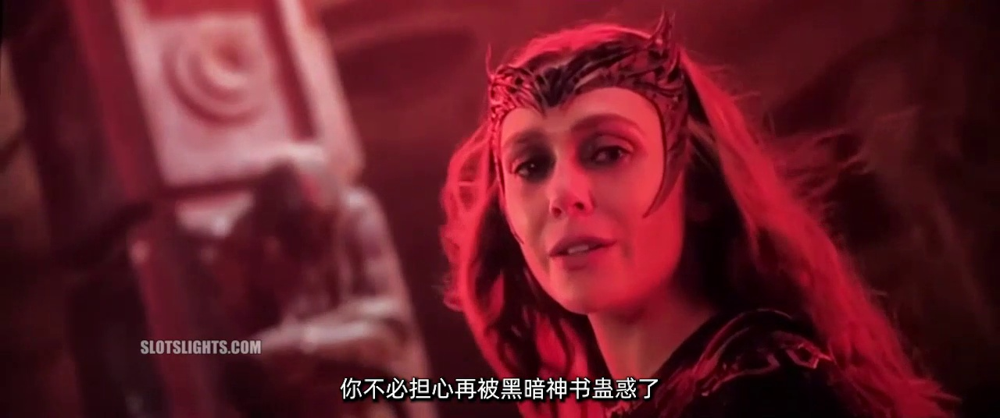
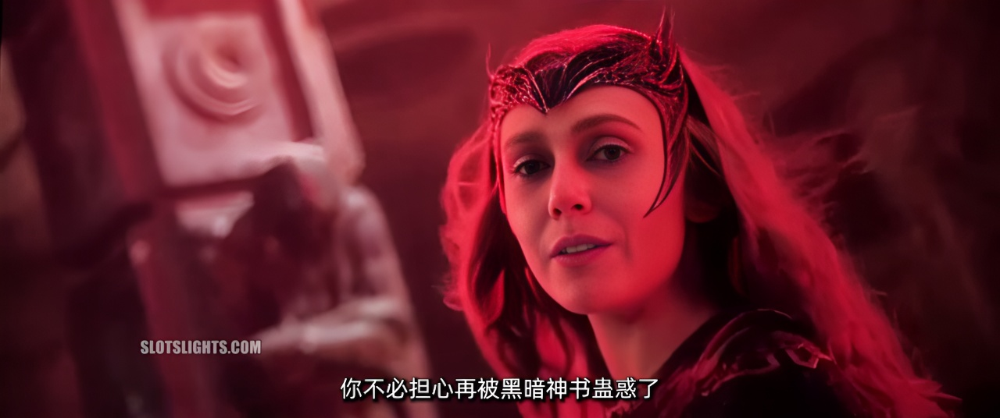
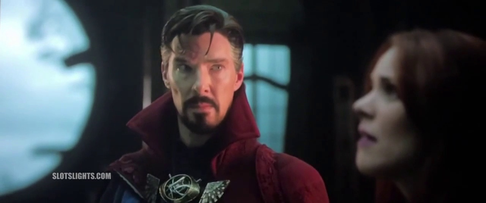
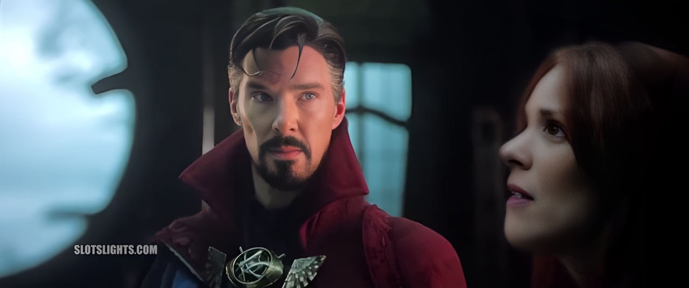
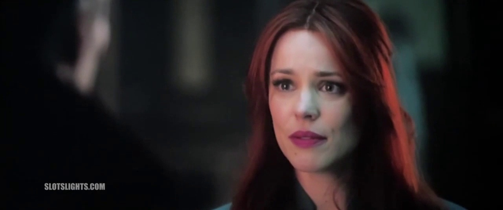
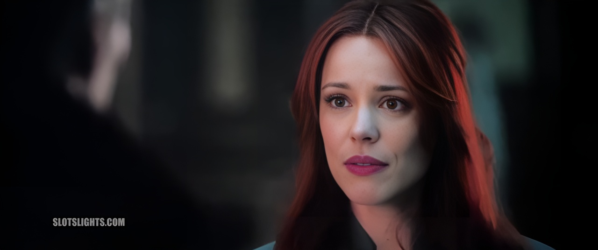

# 视频超分辨率重建

## 效果展示

**分别为原视频、超分辨率视频的截图**

- **对比一**

<p align="center">
  

<p align="center">
  
- **对比二**

<p align="center">
  

<p align="center">
  
- **对比三**

<p align="center">
  

<p align="center">
  

## 项目基础环境

- Python >= 3.7 ( 推荐使用 Anaconda 或 Docker )
- PyTorch >= 1.7
- NVIDIA GPU + CUDA
- Linux ( Windows 和 Mac 未测试过 )

## 项目依赖安装

- 这里基于 Anaconda 基础环境

1. 创建虚拟环境

   ```bash
   conda create -n video python=3.7
   conda activate video
   ```

2. 安装cuda和cudnn

   ```bash
   conda install cudatoolkit=10.2
   conda install cudnn
   ```

3. 克隆项目

   ```bash
   git clone https://github.com/emptysoal/VideoRestore.git
   cd VideoRestore
   ```

4. 安装依赖包（安装慢的话，下面 pip 命令后面加上 "-i https://pypi.tuna.tsinghua.edu.cn/simple/"）

   ```bash
   pip install numpy
   pip install torch==1.7.0
   pip install torchvision==0.8.0
   pip install basicsr
   pip install facexlib
   
   pip install -r requirements.txt
   python setup.py develop
   
   pip install realesrgan
   ```

## 下载预训练权重

- 下载权重文件：[GFPGANv1.3.pth](https://github.com/TencentARC/GFPGAN/releases/download/v1.3.0/GFPGANv1.3.pth)

下载好模型后放到项目`experiments/pretrained_models`目录下

## 视频转换

1. 在`video_rebuild`目录下，创建 src 目录；

2. 把需要修复的视频文件放到`video_rebuild/src`目录下；

3. 启动项目

   运行命令格式如下：

   ```bash
   python video_rebuild/main.py --video ./video_rebuild/src/<待修复视频> --save-path ./video_rebuild/result/<输出的视频>
   ```

   例如：

   ```bash
   python video_rebuild/main.py --video ./video_rebuild/src/demo04.mp4 --save-path ./video_rebuild/result/output.mp4
   ```

   - 如果需要保存每一帧的图像，可以在命令最后加上`--save-frame`，但是会使输出结果太大，不建议保存每一帧；

   - 输出的结果存储在项目`video_rebuild/result`目录下。

